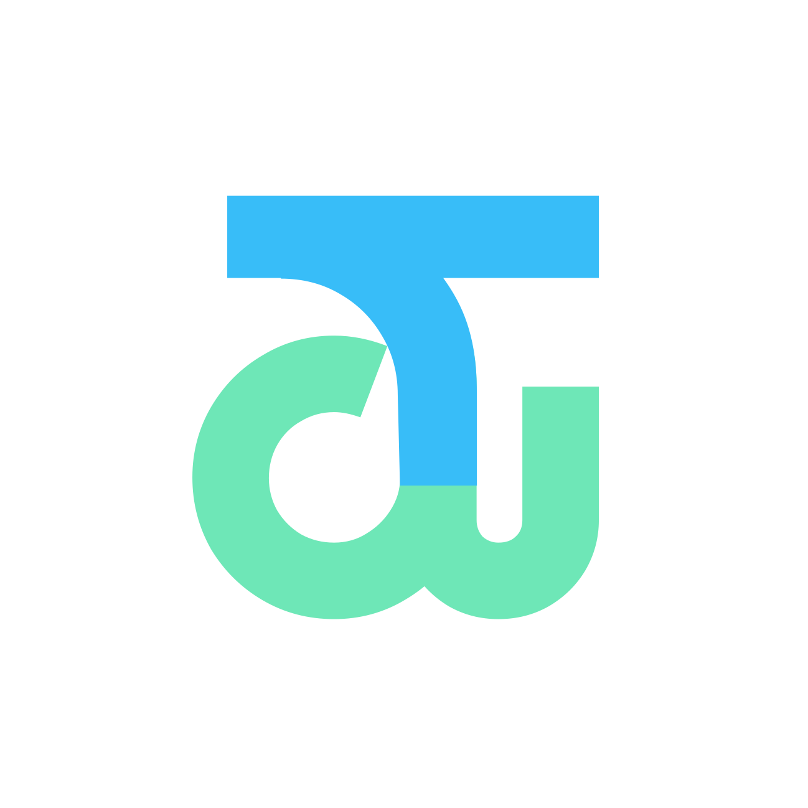

<br/>

<br/>
<br/>

<a href="https://tikitak.space">
  
</a>

<br/>

> 우리 팀이 탁! 맞는 순간, 티키탁


티키탁(Tiki-Tak) 은 대학생 팀 프로젝트 과정의 순간들을 함께 기록하고 회고하는 팀 단위 아카이브 서비스입니다.

<br/>

## 📱 주요 기능

### 🙋 오늘의 질문

매일 팀에게 하나의 질문이 주어집니다. 답을 남기면 그날의 데일리 피드로 기록되어 팀원과 공유됩니다.

- 매일 새로운 질문으로 지속적인 참여를 유도합니다.
- 답변은 피드 게시물로 바로 확인 가능합니다.


### 📅 활동 페이지

흩어진 팀의 기록을 한 달 단위로 큐레이션해, 다시 꺼내보는 회고를 만듭니다.

- **이달의 Best 출석** — 한 달 동안 가장 많이 태그된 팀원의 순위를 보여줍니다.
- **이달의 추억** — '모두의 PICK', '지역별로 모아보는 사진' 등 한 달 동안의 기록을 모아서 보여줍니다.
- **이달의 추천 장소** — 팀의 자주 가는 위치를 기반으로 팀이 함께할 장소를 추천합니다.


### 🗺️ 홈 / 피드

동일한 기록 데이터를 **장소순(지도)** 과 **시간순(피드)** 두 가지 진입점으로 조회합니다.

- **지도** — 지도 위에 기록이 남은 장소를 핀으로 표시하고, 그 장소에 남긴 기록을 모아서 볼 수 있습니다.
- **피드** — 팀의 모든 기록을 최신 순 그리드나 리스트로 모아 빠르게 훑어볼 수 있습니다.


### ✍️ 글쓰기

사진·텍스트·위치·팀원 태그를 하나의 게시물로 묶어, 기록이 흩어지지 않게 남깁니다.

- **위치 추가** — 장소를 검색해 게시물에 붙이면 지도에서도 함께 보입니다.
- **인원 추가** — 그 순간 함께한 팀원을 선택해 태그합니다.
- 사진과 글을 함께 담아 하나의 기록으로 완성합니다.


### 👬 팀 관리

팀명과 한 줄 소개만으로 간단히 팀을 만들고, 팀원을 초대해 함께 기록합니다.

- **간편한 팀 생성** — 팀 이름과 한 줄 소개만 입력하면 바로 시작합니다.
- **QR · 링크 초대** — 초대 QR 코드를 보여주거나 초대 링크를 복사해 팀원을 불러옵니다.
- 여러 팀에 속한 경우 헤더에서 활동할 팀을 전환할 수 있습니다.


<br/>

## 🔧 기술 스택

<table>
  <tr>
    <th align="center">역할</th>
    <th align="center">종류</th>
  </tr>
  <tr>
    <td align="center"><b>Core</b></td>
    <td>
      
      
      
      
    </td>
  </tr>
  <tr>
    <td align="center"><b>Build</b></td>
    <td>
      
      
    </td>
  </tr>
  <tr>
    <td align="center"><b>Styling</b></td>
    <td>
      
      
       </td>
  </tr>
  <tr>
    <td align="center"><b>State &amp; Data</b></td>
    <td>
      
      
    </td>
  </tr>
  <tr>
    <td align="center"><b>Communication</b></td>
    <td>
      
    </td>
  </tr>
  <tr>
    <td align="center"><b>Map</b></td>
    <td>
      
      
    </td>
  </tr>
  <tr>
    <td align="center"><b>Authentication</b></td>
    <td>
      
      
      
    </td>
  </tr>
  <tr>
    <td align="center"><b>Hybrid App</b></td>
    <td>
      
    </td>
  </tr>
  <tr>
    <td align="center"><b>Testing</b></td>
    <td>
      
      
      
    </td>
  </tr>
  <tr>
    <td align="center"><b>Infra</b></td>
    <td>
      
      
    </td>
  </tr>
  <tr>
    <td align="center"><b>Tooling</b></td>
    <td>
      
      
      
      
      
    </td>
  </tr>
</table>

<br/>

## 🚀 시작하기

```bash
yarn install   # 의존성 설치 (Yarn Berry)
yarn dev       # 개발 서버 실행
yarn build     # 프로덕션 빌드
yarn storybook # 컴포넌트 스토리북
yarn test      # 단위 테스트 (Vitest)
yarn e2e       # E2E 테스트 (Playwright)
```

### 📱 하이브리드 앱 (Capacitor)

```bash
yarn cap:sync:ios       # 빌드 후 iOS 프로젝트 동기화
yarn cap:run:ios        # iOS 시뮬레이터 실행
yarn cap:sync:android   # 빌드 후 Android 프로젝트 동기화
yarn cap:run:android    # Android 에뮬레이터 실행
```

<br/>

## 🗂️ 프로젝트 구조

```
├─ src/
│  ├─ app/              # 앱 전역 설정 및 진입 계층
│  │  ├─ layout/        # 공통 레이아웃 컴포넌트
│  │  ├─ lib/           # 앱 전역 유틸리티
│  │  ├─ providers/     # QueryClient, Router 등 전역 Provider
│  │  ├─ routes/        # 라우팅 설정
│  │  ├─ styles/        # 글로벌 스타일 및 디자인 토큰
│  │  └─ App.tsx        # 앱 루트 컴포넌트
│  │
│  ├─ pages/            # 페이지 단위 화면 구성
│  │
│  └─ shared/           # 여러 영역에서 재사용되는 공통 리소스
│     ├─ api/           # API 클라이언트 및 요청 함수
│     ├─ assets/        # 이미지, 아이콘, 폰트 등 정적 리소스
│     ├─ constants/     # 상수 관리
│     ├─ hooks/         # 공통 커스텀 훅
│     ├─ lib/           # 범용 유틸 함수
│     ├─ stores/        # Zustand 기반 전역 상태
│     ├─ types/         # 공통 타입 정의
│     └─ ui/            # 공용 UI 컴포넌트
│
└─ tokens/              # 디자인 토큰 (Style Dictionary)
```

<br/>

## 👥 팀원

<table>
  <tr>
    <td align="center"></td>
    <td align="center"></td>
  </tr>
  <tr>
    <td align="center"><a href="https://github.com/KyeongJooni">이경준</a></td>
    <td align="center"><a href="https://github.com/wlsldm">조수진</a></td>
  </tr>
</table>

<br/>
